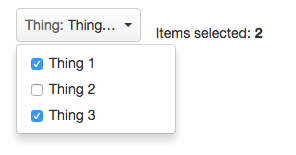

so-multiselect [](https://travis-ci.org/gordonmcg-sonalake/so-multiselect) [](https://codecov.io/github/gordonmcg-sonalake/so-multiselect) []()
================
> Angular module that provides a multi-select dropdown list using checkboxes.



Requirements
-----

The required dependencies are:

* [AngularJS](http://angular.org) (tested with version 1.2.28+)

This module was built with the intention of using it alongside [UI Bootstrap](https://github.com/angular-ui/bootstrap).

Getting Started
---------------

### Installation via Bower

The easiest way to install the module is to use bower:

```
bower install gordonmcg-sonalake/so-multiselect --save
bower update
```

### Basic Usage

Include the CSS and JS files in your `index.html` file:

```html
<script src="so-multiselect.js"></script>
<link rel="stylesheet" href="so-multiselect.css">
```

Declare dependencies on your module app like this:

```html
angular.module('myModule', ['so.multiselect']);
```

Set up your models in your controller:

```javascript

$scope.things = [{
	key: 't1',
	name: 'Thing 1'
}, {
	key: 't2',
	name: 'Thing 2'
}, {
	key: 't3',
	name: 'Thing 3'
}];

$scope.selectedItems = [];

$scope.onThingsSelected = function(selectedItems) {
	$scope.selectedItems = selectedItems;
};
```

Apply the directive to your HTML:

```html
<div so-multiselect items="things" name="Thing" on-selected="onThingsSelected(selectedItems)" button-class="btn-grey"></div>
```

* `items` takes a reference to the array of object to appear in the dropdown list, each object containing a `key` and `name`.
* `name` is the value for the label that appears inside the trigger for the dropdown list.
* `on-selected` takes a reference to the callback function you want to execute when an item is selected in the list. The `selectedItems` parameter contains an array of the selected objects.
* `button-class` is an optional attirbute if you wish to add any extra CSS classes to the trigger for the dropdown list.

Development
-----

### Building

We are using [npm](http://npmjs.com/), [bower](http://bower.io/) and [grunt](http://gruntjs.com/) as part of our development process.
To build the module from scratch, run the following commands:

```
npm install -g grunt-cli
npm install
bower install
grunt build
```

### Testing

We use [karma](http://karma-runner.github.io/0.12/index.html) and [protractor](http://angular.github.io/protractor/#/) to ensure the quality of the code.
To run the tests, run the following commands:

```
npm install -g grunt-cli
npm install
bower install
grunt test
```

### All Together

Running the tests and building the application can be done together using the following commands:

```
npm install -g grunt-cli
npm install
bower install
grunt
```

License
-----
[MIT License](http://en.wikipedia.org/wiki/MIT_License)
